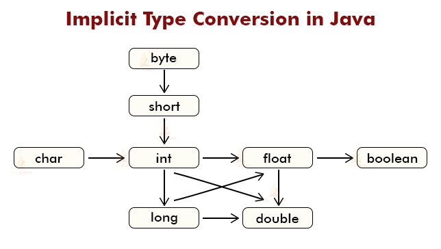
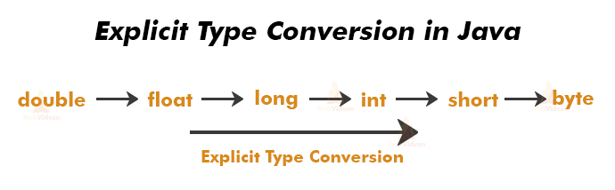

1. JVM Architecture(exam)
2. memory model

2. Identifier
3. Naming convention
4. Reserved keyword

### data types: 
- primitive datatype:
``
  ```primitive data types
  1. Integer type: byte(-128, 127), short(-32768,32767), int , long  e.g. 1, 23,67
  2. Floating type: float, double  e.g 1.2, 36.0
  3. Boolean type:  boolean e.g. true, false
  4. Character type : char  single characters e.g "a",  ASCI- 65, 97
``


###Type conversion(jvm) and type casting(programmer)

(implicit -jvm)

(explicit --programmer)


#git version control
git command:
```1. git add .   // add file to the git repository
   2. git commit -m "message"  // message 
   3. git push origin master   // remote add
   4. git status  // check my changes
```


### Arrays
arrays: 

```
i. declaration
    data_type array_name [][]......;
    
ii. initialization
    array_name = new data_type[array_size]
    
```
- one dimensional,
- two dimensional(multi),
- anynomous arrays --  no array name ```

## Constructor -- data set(Entity)
## display() -- get information

## Getter(data get) and Setter(data set)

## POJO Class:
```aidl
School management system:

1. Entity collect:

Student, Techer, Management, Staff, DA,.............
- every POJO class has propertis

- every POJO class may be a (database Table)
- every POJO class has a(Relations)

2.ER-diagram:
- relations represent
```

## Composition -- has a relation

- Teacher has a Student
- Student has a Address

## if else: true or false
```aidl

```
## switch: ///better performance

## Inheritance
## Abstraction and Interface


