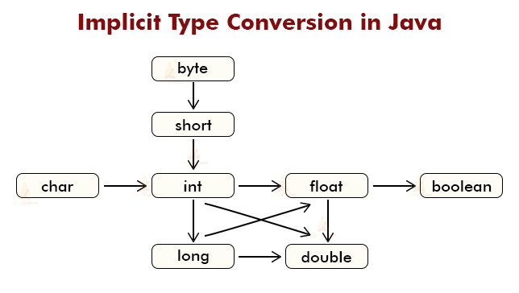
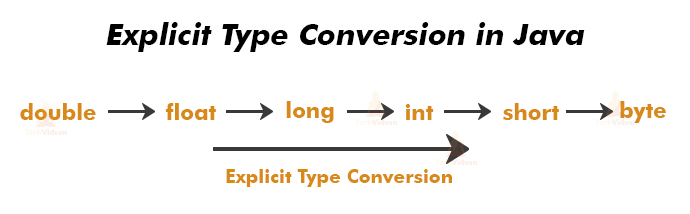

1. JVM Architecture(exam)
2. memory model

2. Identifier
3. Naming convention
4. Reserved keyword






#git version controll
git command:
```1. git add .   // add file to the git repository
   2. git commit -m "message"  // message 
   3. git push origin master   // remote add
   4. git status  // check my changes
```
